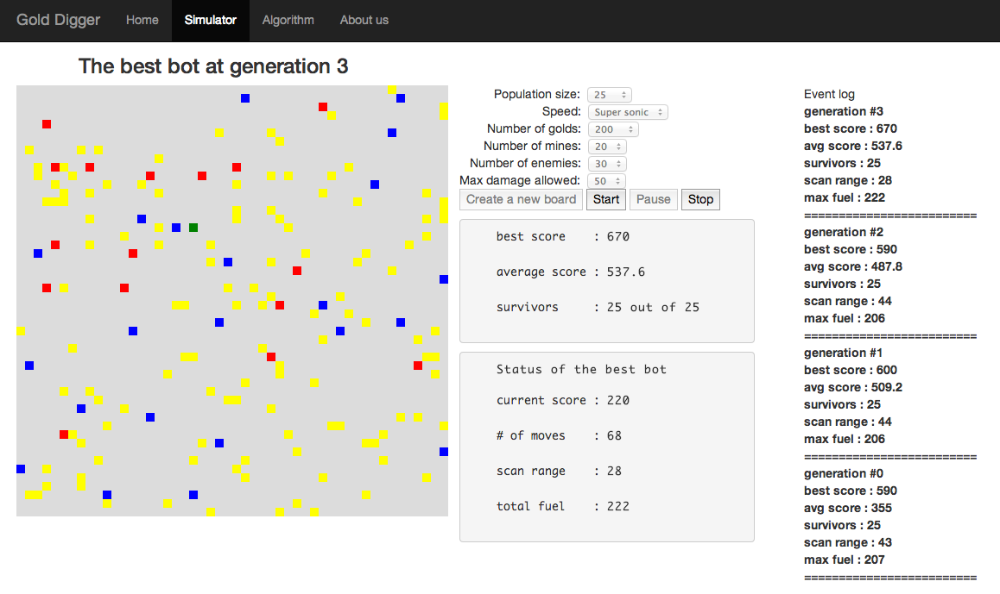

#Gold Digger
A rails app that shows how genetic algorithm works.



##Brief Overview
Gold Digger provides a visual simulation of how genetic algorithm works. The app creates a population of bots with random traits, and tries to improve each population through genetic algorithm.

### Fitness Function
At each generation, all bots are tested individually against the same environment. In the given environment, a bot gains positive score by collecting gold, and loses points by either stepping on a mine or getting hit by an enemy. A bot is evaluated by how much score it gained at the end of simulation. So the bot(s) with the highest score is the fittest.

### Environment
**Board** : 50 x 50 square board. This is the "world" where a bot lives.

**Bot** : Tries to collect gold while avoiding mines and enemies. Drawn as a ***green*** square.

**Enemy** : Prevents the bot from achieving scores by collecting golds and hitting the bot. Disappears once it hits the bot. Drawn as a ***blue*** square.

**Mine** : Damages a bot if stepped on. Disappears once it gets stepped on. Drawn as ***red*** square.

**Gold** : Gives a positive score to a bot when collected. Disappears once it gets collected. Drawn as ***yellow*** square.


## Technology used
- Ruby on Rails (v4.0.1)
- Javascript


## How to run this locally
1. [Install rails](http://guides.rubyonrails.org/getting_started.html "Ruby on Rails guide")
2. Pull source code from github

```
git clone https://github.com/TurtleShip/gold_digger
```
3. Start the server

```
cd gold_digger

rails s
```
4. The app is now ready. Check it out by visiting http://localhost:3000


